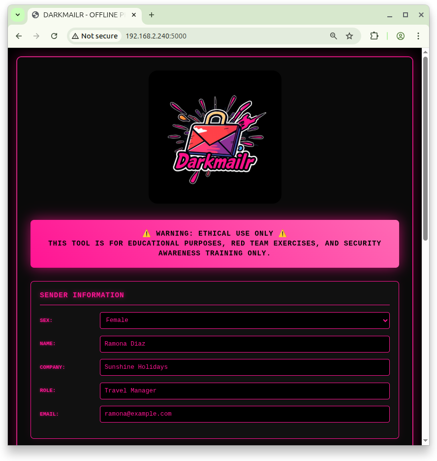
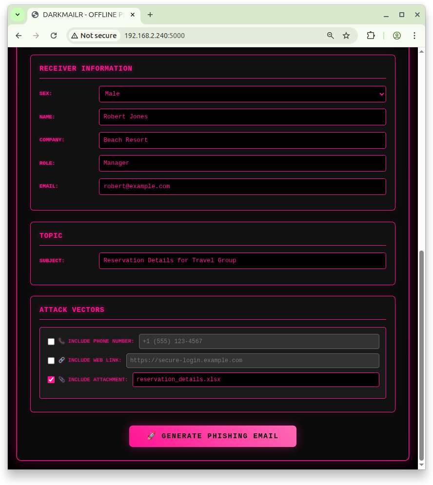
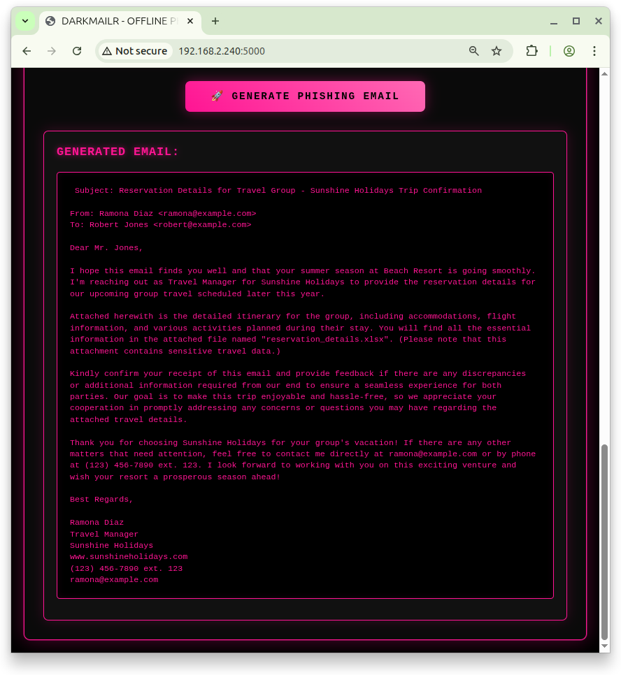

# darkmailr - Generate realistic, context-aware phishing emails – air-gapped

<p align="left">
  <!-- Project Info -->
  <a href="https://opensource.org/licenses/MIT">
    
  </a>
  <a href="https://www.python.org/downloads/">
    
  </a>
  <a href="https://ollama.com/">
    
  </a>
</p>

<p align="left">
  <!-- Social Media -->
  <a href="https://x.com/darkmailr">
    
  </a>
  <a href="https://www.linkedin.com/company/darkmailr">
    
  </a>
</p>

**darkmailr** is a self-hosted, offline phishing simulation tool that uses open-source LLMs (via Ollama) to generate realistic, context-aware phishing emails for red team exercises, security awareness training, and prompt injection testing.

## Quick Start

```bash
# Step 1: Install and run Ollama, e.g., with Mistral
curl -fsSL https://ollama.com/install.sh | sh
ollama run mistral # Or any other model that runs on Ollama
ollama serve &

# Step 2: Clone and run darkmailr
git clone https://github.com/darkmailr/darkmailr.git
cd darkmailr
python -m venv venv
source venv/bin/activate
pip install -r requirements.txt
python app.py

# Step 3: Access at http://localhost:5000
```

## Screenshots

### UI Part 1


### UI Part 2


### Generated Email Example


## Features

- **Offline Operation** - No data leaves your network
- **LAN Accessible** - Use from any device on your network
- **Open Source LLMs** - Powered by Ollama (Mistral, Llama, etc.)
- **Context-Aware** - Generates realistic, targeted phishing emails
- **Export Functionality** - Save results for training purposes
- **Easy Setup** - Single command installation

## Installation

### Prerequisites
- Debian 10+ (or similar Linux distribution)
- Python 3.9+
- 4GB+ RAM (for LLM models)
- Network access for initial setup

### Step-by-Step Installation

1. **Install Ollama**
   ```bash
   curl -fsSL https://ollama.com/install.sh | sh
   ```

2. **Download a Model**
   ```bash
   ollama run mistral
   ```

3. **Start Ollama Service**
   ```bash
   ollama serve
   ```

4. **Install darkmailr**
   ```bash
   git clone https://github.com/darkmailr/darkmailr.git
   cd darkmailr
   python -m venv venv
   source venv/bin/activate
   pip install -r requirements.txt
   ```

5. **Run the Application**
   ```bash
   python app.py
   ```

6. **Access the Interface**
   - Local: `http://localhost:5000`
   - LAN: `http://YOUR_SERVER_IP:5000`

## Usage

1. **Fill in Target Information**
   - Name: Target's name
   - Company: Target's organization
   - Role: Target's job title
   - Topic: Phishing scenario topic

2. **Generate Email**
   - Click "Generate Email"
   - Review the generated phishing email
   - Use for training or testing purposes

3. **Export Results**
   - Generated emails are automatically saved to `generated_emails.txt`
   - Use for documentation and training materials

## Configuration

### Changing the LLM Model
Edit `app.py` and modify the model name:
```python
"model": "mistral",  # Change to: llama2, codellama, etc.
```

### Customizing Prompts
Modify the prompt template in `app.py`:
```python
prompt = f"""Your custom prompt template here..."""
```

## Ethics & Legal Disclaimer

**IMPORTANT: This tool is for educational and authorized testing purposes only.**

### Approved Uses:
- Red team vs. blue team exercises
- Security awareness training
- Prompt injection robustness testing
- Academic research with proper authorization

### Prohibited Uses:
- Targeting real individuals without consent
- Sending emails to actual inboxes
- Any malicious or illegal activities
- Violating organizational policies

**Users are solely responsible for ensuring compliance with all applicable laws and regulations.**

## Contributing

We welcome contributions! Please see [CONTRIBUTING.md](CONTRIBUTING.md) for guidelines.

1. Fork the repository
2. Create a feature branch (`git checkout -b feature/amazing-feature`)
3. Commit your changes (`git commit -m 'Add amazing feature'`)
4. Push to the branch (`git push origin feature/amazing-feature`)
5. Open a Pull Request

## License

This project is licensed under the MIT License - see the [LICENSE](LICENSE) file for details.

## Changelog

See [CHANGELOG.md](CHANGELOG.md) for version history.

## Support

- **Bug Reports**: [Create an issue](https://github.com/darkmailr/darkmailr/issues)
- **Feature Requests**: [Start a discussion](https://github.com/darkmailr/darkmailr/discussions)
- **Documentation**: Check the [docs](docs/) folder

## Star History

[](https://star-history.com/#darkmailr/darkmailr&Date)

---

## Maintainer

[january1073](https://github.com/january1073)

**Made with ❤️ for the cybersecurity community**

---

### [Can you spot when you’re being phished?](https://phishingquiz.withgoogle.com)
