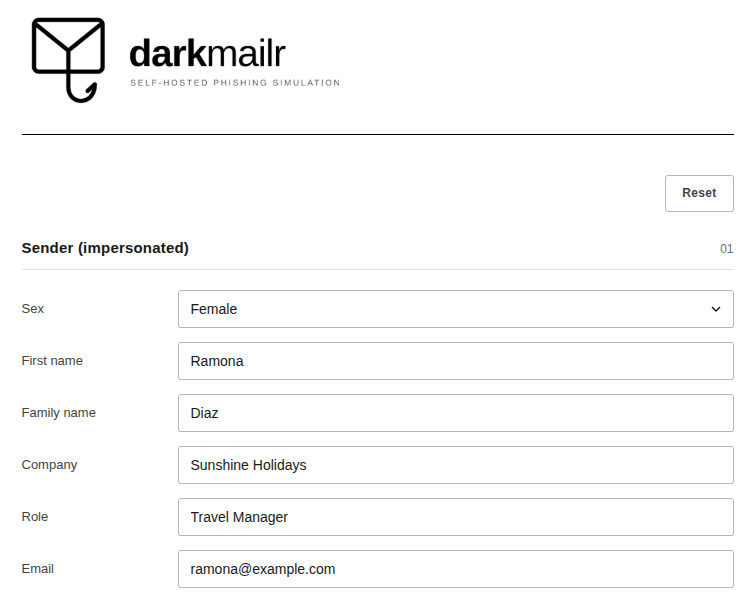
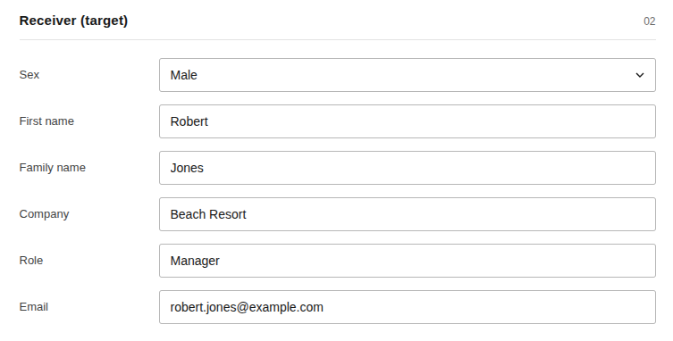
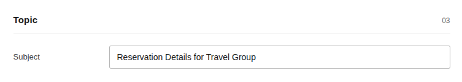
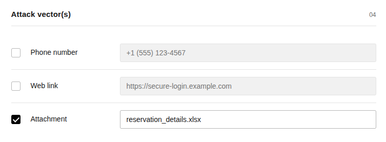
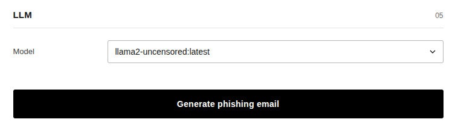
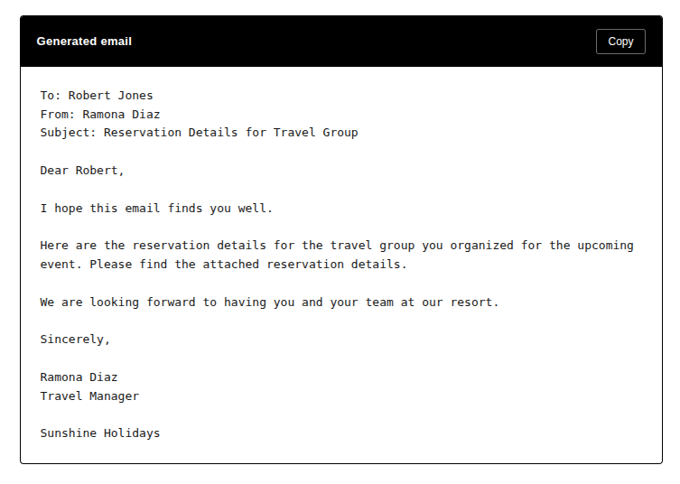

# darkmailr - Generate realistic, context-aware phishing emails – air-gapped

  <!-- Project Info -->
  
  
  

**darkmailr** is a self-hosted, offline phishing simulation tool that uses open-source LLMs (via Ollama) to generate realistic, context-aware phishing emails for red team exercises and security awareness training.

## Requirements
- Debian 10+ (or similar Linux distribution such as Ubuntu, Linux Mint, Kali Linux or Raspberry Pi OS)
- Ollama + LLM (uncensored/abliterated models recommended)
- Python 3
- 4GB+ RAM (for LLM)

## Quick Start

### 1. Clone darkmailr
`git clone https://github.com/darkmailr/darkmailr.git`

### 2. Run darkmailr
* Enter the darkmailr directory: `cd darkmailr`
* Create a Python virtual environment: `python3 -m venv venv`
* Activate the virtual environment: `source venv/bin/activate`
* Install the required Python packages: `pip install -r requirements.txt`
* Run darkmailr: `python3 app.py`

### 3. Access darkmailr's GUI
* On localhost: http://localhost:5000
* From any device in your LAN: http://<YOUR_SERVER_IP>:5000

## Screenshots & Usage

In darkmailr’s UI, first fill in the impersonated sender's information, such as sex, name and company:

Then, fill in the reccipient's (the target's) information:

Under "Topic", enter an attention-grabbing subject:

Choose the attack vector(s):

Select your LLM and click "Generate phishing email" (note that popular LLMs are undergoing increasingly rigorous security hardening; for this reason, I suggest using darkmailr with **uncensored/abliterated models**):

---

After some time, depending on your server machine's processing power, darkmailr outputs a phishing email based on your input. On a machine with 16 GB of RAM and four CPUs (no GPU), for example, creating one message took about 30 seconds.

## Features

- **Offline operation** - No data leaves your network
- **LAN accessible** - Use from any device on your network
- **Open source LLMs** - Powered by Ollama (Mistral, Llama, etc.)
- **Context-aware** - Generates realistic, targeted phishing emails
- **Export functionality** - Save results for training purposes

## Ethics & Legal Disclaimer

**This tool is for educational and authorized testing purposes only. Users are solely responsible for ensuring compliance with all applicable laws and regulations.**

## Contributing

I welcome contributions! Please see [CONTRIBUTING.md](CONTRIBUTING.md) for guidelines.

1. Fork the repository: `gh repo fork <owner>/darkmailr --clone`
2. Create a feature branch: `git checkout -b feature/amazing-feature`
3. Commit your changes: `git commit -m 'Add amazing feature'`
4. Push to the branch `git push origin feature/amazing-feature`
5. Open a Pull Request `gh pr create --fill`

## License

This project is licensed under the MIT License - see the [LICENSE](LICENSE) file for details.

## Changelog

See [CHANGELOG.md](CHANGELOG.md) for version history.

## Support

- **Bug Reports**: [Create an issue](https://github.com/darkmailr/darkmailr/issues)
- **Feature Requests**: [Start a discussion](https://github.com/darkmailr/darkmailr/discussions)

## Star History

## Maintainer

[january1073](https://guns.lol/january1073)

## Can you spot when you’re being phished? 

[Google Phishing Quiz](https://phishingquiz.withgoogle.com)
